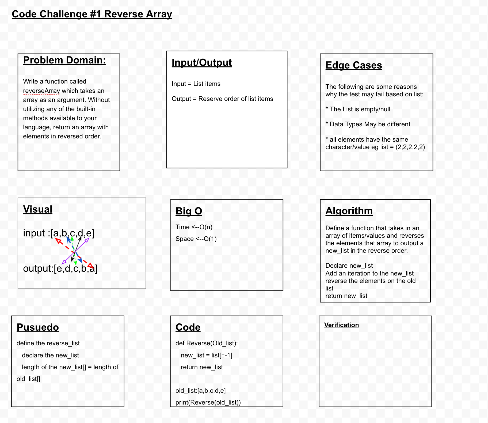

# Code Challenges

1. ## Reverse Array

## **Problem Domain**

Write a function called ``reverseArray`` which takes an array as an argument. Without utilizing any of the built-in methods available to your language, return an array with elements in reversed order.

## **Input/Output**

Input = List items

Output = Reserve order of list items

## **Edge Cases**

The following are some reasons why the test may faile based on list:

* The List is empty/null

* Data Types May be different

* all elements have the same character/value eg ``list = (2,2,2,2,2)``

## **Visual**

input :[a,b,c,d,e]

output:[e,d,c,b,a]

## **Big O**

Time <--O(n)
Space <--O(1)

## **Algorithm**

> Define a function that takes in an array of items/values and reverses the elements that array to ouput a new_list in the reverse order.
> Declare new_list
> Add an iteration to the new_list
>reverse the elements on the old list
>return new_list

## **Pusuedo**

define the reverse_list
    declare the new_list
    length of the new_list[] = length of old_list[]

## **Code**

def Reverse(Old_list):
    new_list = list[::-1]
    return new_list

old_list:[a,b,c,d,e]
print(Reverse(old_list))

## **Verification**
